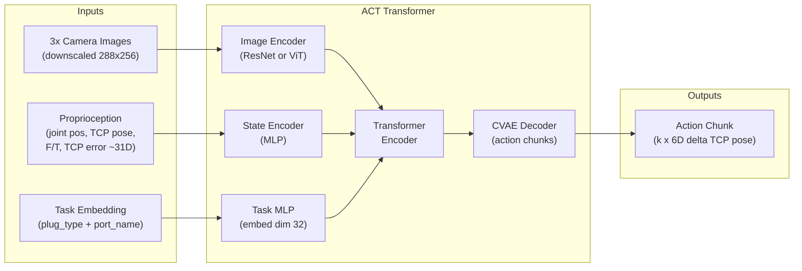

# AIC Cable Insertion Challenge: Full Training Plan

## Assessment of Your Proposed Approach

Your two-stage idea (pretrain with BC, then RL with scoring-based rewards) is sound and well-suited to this challenge. Here is how I would refine it:

- **BC pretraining** -- rather than manual teleoperation, use the `CheatCode` policy ([aic_example_policies/aic_example_policies/ros/CheatCode.py](aic_example_policies/aic_example_policies/ros/CheatCode.py)) to generate thousands of expert demonstrations automatically, recording the visual observations the learned policy will actually consume. This avoids the bottleneck of human teleoperation.
- **RL fine-tuning** -- the scoring criteria translate directly into a dense shaped reward. Isaac Lab (GPU-parallelized) is the right place to run RL given your A100 access.
- **Task conditioning** -- a small learned embedding of `(plug_type, port_name)` concatenated with proprioceptive state before the transformer encoder. This is sufficient given only 3 unique task types.

---

## Architecture Overview




**Action space**: 6D delta TCP pose (dx, dy, dz, droll, dpitch, dyaw) relative to current gripper pose, sent as absolute target via `MotionUpdate` with `MODE_POSITION`. Position mode is preferred over velocity mode for insertion because the impedance controller naturally provides the compliance needed during contact.

**Observation space (for the model)**:

- 3 camera images downscaled from 1152x1024 to ~288x256 (0.25x, matching RunACT convention)
- Proprioception vector (~31D): 6 joint positions, TCP position (3), TCP orientation quat (4), TCP linear velocity (3), TCP angular velocity (3), tcp_error (6), F/T wrench (6)
- Task conditioning token: learned embedding from `(plug_type, port_name)` categorical

---

## Phase 0: Automated Expert Data Collection

**Goal**: Generate 3000-5000+ successful insertion demonstrations across randomized task board configurations, covering all three task types.

**Strategy**: Build a harness that programmatically launches Gazebo with randomized configs, runs `CheatCode` to execute the insertion, and records the observations + actions in LeRobot dataset format.

**Key files to leverage**:

- [aic_example_policies/aic_example_policies/ros/CheatCode.py](aic_example_policies/aic_example_policies/ros/CheatCode.py) -- the expert policy (uses ground truth TF, not vision)
- [aic_engine/config/sample_config.yaml](aic_engine/config/sample_config.yaml) -- config schema for trials
- [aic_bringup/launch/aic_gz_bringup.launch.py](aic_bringup/launch/aic_gz_bringup.launch.py) -- launch with randomized params
- [aic_utils/lerobot_robot_aic/](aic_utils/lerobot_robot_aic/) -- LeRobot dataset format + robot interface

**What to build**:

1. A **config generator** script that produces randomized YAML trial configs within the documented limits:
  - Task board pose: randomize x, y, z (within workspace), yaw (full range)
  - NIC cards: random rail (0-4), translation [-0.0215, 0.0234]m, yaw [-10, +10] deg
  - SC ports: random rail (0-1), translation [-0.06, 0.055]m
  - Cable type: `sfp_sc_cable` or `sfp_sc_cable_reversed`
  - Grasp offset: add noise (~2mm, ~0.04 rad) to nominal gripper_offset
2. A **data collection loop** that for each config:
  - Launches Gazebo with `ground_truth:=true` and the randomized config
  - Runs CheatCode via the `aic_engine` pipeline
  - Records the `Observation` messages (cameras, joints, F/T, controller state) and the `MotionUpdate` commands sent by CheatCode
  - Saves to LeRobot HuggingFace dataset format with task metadata columns (`plug_type`, `port_name`)
  - Tears down and repeats
3. **Data balance**: aim for roughly equal representation across the 3 task types:
  - SFP into SFP_PORT_0 (~1000-1500 demos)
  - SFP into SFP_PORT_1 (~1000-1500 demos)
  - SC into SC_PORT (~1000-1500 demos)

**Tip**: Export `/tmp/aic.sdf` after each spawn (docs describe this) to also create MuJoCo-compatible training scenes for Phase 2.

---

## Phase 1: Task-Conditioned Behavior Cloning

**Goal**: Train a vision-based policy that replicates CheatCode's behavior from camera images + proprioception + task embedding alone (no ground truth TF).

**Architecture: Modified ACT (Action Chunking with Transformers)**

Start from LeRobot's `ACTPolicy` ([lerobot.policies.act.modeling_act](https://github.com/huggingface/lerobot)) and modify:

1. **Task conditioning**: Add a `TaskEmbedding` module:
  - Input: categorical index for `(plug_type, port_name)` -- 3 unique values: `(sfp, sfp_port_0)`, `(sfp, sfp_port_1)`, `(sc, sc_port_base)`
  - `nn.Embedding(3, 32)` projected through a small MLP to match transformer hidden dim
  - Concatenated as an extra token to the transformer encoder input sequence (alongside image tokens and state tokens)
2. **Image encoder**: ResNet-18 backbone (LeRobot ACT default), processing 3 cameras independently, each downscaled to 288x256. Each produces a spatial feature map that is flattened + projected to transformer tokens.
3. **State encoder**: MLP that encodes the 31D proprioceptive vector into transformer hidden dim.
4. **Action head**: Predict a chunk of `k=20` actions (6D delta TCP pose each), executed open-loop at ~10 Hz = 2 seconds of action per inference. Temporal ensembling across overlapping chunks for smoothness.

**Training details**:

- Framework: Custom PyTorch training loop (gives flexibility for later RL). Can start from LeRobot's ACT training code as a template.
- Loss: L1 on action predictions (standard ACT loss) + CVAE KL term
- Optimizer: AdamW, lr=1e-4, cosine schedule, 500 epochs
- Batch size: 64 (fits A100 80GB with 3 cameras)
- Data augmentation: color jitter, random crop, brightness/contrast on camera images
- Validation: hold out 10% of demos, monitor action prediction error + success rate in Gazebo

**Inference integration**: Create a new policy class (like `RunACT.py`) that:

- Loads the trained model
- Reads `task.plug_type` and `task.port_name` from the `Task` message to select the task embedding index
- Runs the ACT model on observations
- Converts predicted delta TCP poses to absolute poses
- Sends via `set_pose_target()` with `MODE_POSITION`

**Expected outcome**: A policy that succeeds on 60-80% of insertions across randomized configs, with imperfect precision and suboptimal scoring metrics.

---

## Phase 2: RL Fine-tuning

**Goal**: Optimize the pretrained policy for the full scoring objective -- maximize insertion success, minimize force/jerk, improve efficiency.

**Environment**: Isaac Lab (`AIC-Task-v0` at [aic_utils/aic_isaac/aic_isaaclab/](aic_utils/aic_isaac/aic_isaaclab/)) with GPU parallelization. This is critical for RL sample efficiency given A100 access. The repo already has `rsl_rl` integration and domain randomization helpers (`events.py` with `randomize_object_pose`).

**Reward function** (derived from [docs/scoring.md](docs/scoring.md)):

```
R_total = R_proximity + R_insertion + R_smoothness + R_duration + R_force + R_contact

R_proximity:  +scaled(1/distance_to_port)         (dense, every step)
R_insertion:  +50 partial, +75 full                (sparse, on event)
R_wrong_port: -12                                  (sparse, on event)
R_smoothness: -lambda_jerk * jerk_magnitude        (dense, every step)
R_duration:   +bonus if done quickly               (sparse, on completion)
R_force:      -12 if F > 20N for > 1s              (sparse, triggered)
R_contact:    -24 if off-limit contact              (sparse, triggered)
```

Key design choices:

- **Dense proximity reward** is essential to guide the policy toward the port before insertion events fire
- **Jerk penalty** as a small continuous penalty rather than end-of-episode scoring -- this encourages smooth motion throughout
- **KL penalty** to pretrained BC policy to prevent catastrophic forgetting: `R -= beta * KL(pi_RL || pi_BC)` with beta annealed from 1.0 down to 0.1

**Algorithm**: PPO (Proximal Policy Optimization)

- Warm-start from BC policy weights (actor + critic initialized from pretrained encoder)
- 256-512 parallel environments in Isaac Lab
- Observation: same as BC (cameras + proprio + task embedding)
- For speed, consider training RL with lower-resolution images (144x128) and fine-tuning back to full resolution
- Horizon: 1000 steps at 20 Hz = 50 seconds (shorter than the 180s time limit to encourage efficiency)

**Curriculum**:

1. Start with small randomization ranges (task board near nominal pose, NIC card centered)
2. Gradually increase randomization to full documented ranges
3. Optionally add noise to observations (camera noise, F/T noise) for robustness

---

## Phase 3: Cross-Sim Validation and Robustness

**Goal**: Ensure the policy generalizes to the Gazebo eval environment despite being RL-trained in Isaac Lab.

- **Sim-to-sim transfer**: Run the final RL policy in Gazebo with the full `aic_engine` pipeline. Measure scoring across 50+ randomized trials.
- **Domain randomization checklist**:
  - Task board pose (position + yaw)
  - NIC card rail selection (0-4) + translation + yaw
  - SC port rail selection (0-1) + translation
  - Grasp pose perturbation (~2mm, ~0.04 rad)
  - Camera image variations (brightness, noise)
  - Physics parameters (friction, damping) if sim gap is observed
- **MuJoCo as a third sim**: Convert some Gazebo configs to MJCF via the repo's pipeline ([aic_utils/aic_mujoco/](aic_utils/aic_mujoco/)) and validate there for additional sim diversity.
- **Ablation**: Test with/without task conditioning to confirm it helps on multi-task scenarios.

---

## Phase 4: Submission Packaging

- Wrap the trained model into a ROS 2 lifecycle node following the spec in [docs/challenge_rules.md](docs/challenge_rules.md) (Section 4)
- Ensure the node:
  - Starts in `unconfigured` state, loads model on `configure` (within 60s timeout)
  - Accepts `/insert_cable` goals only in `active` state
  - Reads `Task.plug_type` and `Task.port_name` for conditioning
  - Returns within `time_limit` (180s)
- Build Docker image per [docs/submission.md](docs/submission.md)
- Run full scoring test suite from [docs/scoring_tests.md](docs/scoring_tests.md) in the eval container

---

## Key Risks and Mitigations

- **Sim-to-sim gap (Isaac Lab to Gazebo)**: Mitigate with cross-sim validation and physics randomization during RL. The docs explicitly encourage multi-simulator training.
- **BC policy quality ceiling**: CheatCode demonstrations are near-optimal but may not cover failure recovery. RL fine-tuning addresses this by learning corrective behaviors.
- **Task conditioning overfitting**: With only 3 task types, the embedding could overfit. Use dropout on the embedding and ensure balanced data.
- **Inference latency**: ACT with 3 cameras on GPU should run well within the ~50ms budget at 20 Hz. Profile early on the target GPU.

